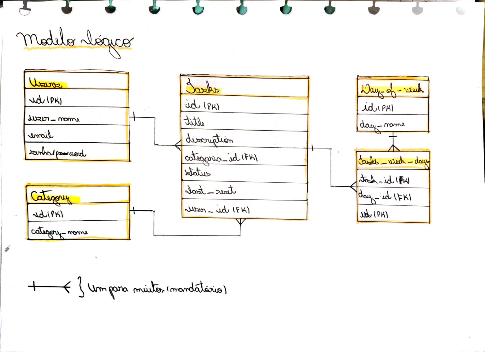
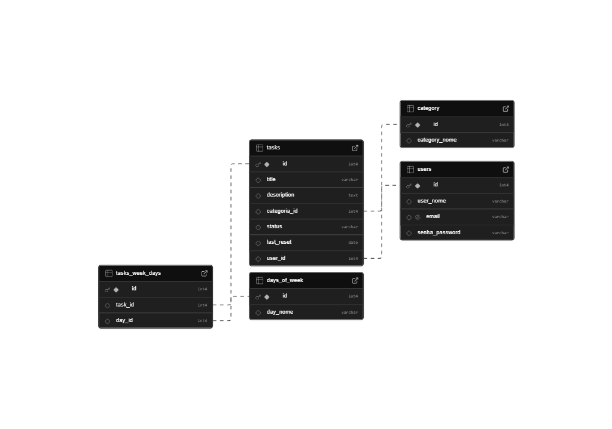
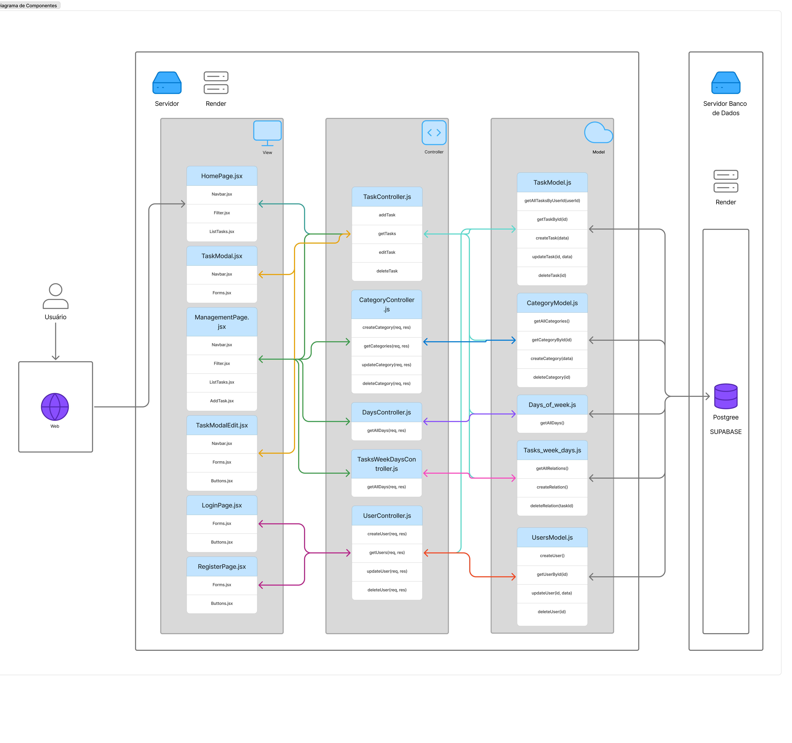

# Web Application Document - Projeto Individual - Módulo 2 - Inteli

## Taskly

#### Letícia Fernandes do Espírito Santo Saravia

## Sumário

1. [Introdução](#c1)
2. [Visão Geral da Aplicação Web](#c2)
3. [Projeto Técnico da Aplicação Web](#c3)
4. [Desenvolvimento da Aplicação Web](#c4)
5. [Referências](#c5)

<br>

## <a name="c1"></a>1. Introdução

O WAD (Website Analysis Document) é o documento central de uma aplicação web. Ele tem como objetivo detalhar o funcionamento, desenvolvimento e principais aspectos técnicos de um software web. Neste documento, serão apresentadas as principais características e decisões do Taskly, incluindo a lógica de funcionamento, arquitetura e componentes utilizados.

Dados recentes indicam que distúrbios e doenças mentais afetam desproporcionalmente as mulheres, em grande parte devido à sobrecarga histórica de responsabilidades sociais e familiares. Essa realidade muitas vezes leva à negligência do autocuidado e compromete a saúde mental.

Pensando nisso, nasceu o Taskly, uma solução desenvolvida para ajudar mulheres a organizarem seus hábitos e tarefas de autocuidado de forma objetiva e intuitiva, promovendo bem-estar físico e mental. O sistema permite o acompanhamento regular dessas tarefas, criando uma estrutura que incentiva a prática constante do autocuidado, mesmo diante de uma rotina exigente.

De forma prática, o sistema é uma interface de tarefas que exibe as atividades do dia, permitindo que sejam marcadas como concluídas ou não. Além disso, inclui uma área de gerenciamento de tarefas, onde é possível criar novas atividades ou excluir as já existentes para dias específicos da semana. A ideia é que essas tarefas se repitam semanalmente, com a plataforma funcionando como um lembrete e ferramenta de gestão de hábitos.

## <a name="c2"></a>2. Visão Geral da Aplicação Web

### 2.1. Personas (Semana 01 - opcional)

_Posicione aqui sua(s) Persona(s) em forma de texto markdown com imagens, ou como imagem de template preenchido. Atualize esta seção ao longo do módulo se necessário._

### 2.2. User Stories (Semana 01 - opcional)

_Posicione aqui a lista de User Stories levantadas para o projeto. Siga o template de User Stories e utilize a referência USXX para numeração (US01, US02, US03, ...). Indique todas as User Stories mapeadas, mesmo aquelas que não forem implementadas ao longo do projeto. Não se esqueça de explicar o INVEST de 1 User Storie prioritária._

---

## <a name="c3"></a>3. Projeto da Aplicação Web

### 3.1. Modelagem do banco de dados

O diagrama de banco de dados é uma ferramenta essencial na elaboração de qualquer sistema. Ele não apenas auxilia na demonstração do funcionamento e lógica que os dados devem seguir, mas também traduz essas informações para os desenvolvedores, criando clareza nos fluxos de dados. Dessa forma, torna-se um elemento indispensável no planejamento do software.

O projeto em questão apresenta dois principais modelos de banco de dados: o modelo lógico e o modelo físico.

O modelo lógico tem como objetivo fornecer uma visão geral dos processos operacionais ou transacionais, apresentando as entidades e suas relações de maneira abstrata. Já o modelo físico é mais detalhado, oferecendo informações que ajudam os administradores e desenvolvedores a implementar a lógica de negócios em um banco de dados real.

**Modelo Lógico** <br>
Abaixo, é possível observar o diagrama lógico:

<div align="center"> <sub>Figura X (Número da imagem) - Modelo Lógico de Banco de Dados</sub>  <sup>Fonte: Material produzido pela autora (2025)</sup> </div>
Este diagrama lógico inclui cinco principais entidades/tabelas: users, tasks, category, day_of_week e tasks_week_days. Ele explicita de forma clara os principais "objetos" e seus relacionamentos no sistema, como a tabela users, que controla o login dos usuários, e as tabelas restantes, que gerenciam as tarefas. Além disso, cada relação entre tabelas é marcada por linhas, com símbolos que representam relações "um para muitos". Embora o modelo aparente simplicidade, suas regras de negócio trazem um grau considerável de complexidade.<br>
<br>

**Modelo Físico** <br>
Agora, é possível observar o diagrama físico:

<div align="center"> <sub>Figura X (Número da imagem) - Modelo Físico Representado</sub>  <sup>Fonte: Material produzido pela autora através da plataforma Supabase (2025)</sup> </div>

O modelo físico foi gerado diretamente na plataforma Supabase, refletindo a estrutura real do banco de dados utilizado. Ele mantém as mesmas entidades e regras descritas no modelo lógico, mas com detalhes adicionais que facilitam a implementação do sistema. Abaixo há os esquemas do Banco de dados:

**Script de Criação**

```sql
-- Tabela de usuários
CREATE TABLE users (
    id INT PRIMARY KEY,
    user_nome VARCHAR(100),
    email VARCHAR(100) UNIQUE,
    senha_password VARCHAR(100)
);

-- Tabela de categorias
CREATE TABLE category (
    id INT PRIMARY KEY,
    category_nome VARCHAR(100)
);

-- Tabela de tarefas
CREATE TABLE tasks (
    id INT PRIMARY KEY,
    title VARCHAR(200),
    description TEXT,
    categoria_id INT,
    status VARCHAR(50),
    last_reset DATE,
    user_id INT,
    FOREIGN KEY (categoria_id) REFERENCES Category(id),
    FOREIGN KEY (user_id) REFERENCES Users(id)
);

-- Tabela dos dias da semana
CREATE TABLE days_of_week (
    id INT PRIMARY KEY,
    day_nome VARCHAR(20)
);

-- Tabela de associação entre tarefas e dias da semana
CREATE TABLE tasks_week_days (
    id INT PRIMARY KEY,
    task_id INT,
    day_id INT,
    FOREIGN KEY (task_id) REFERENCES Tasks(id),
    FOREIGN KEY (day_id) REFERENCES Days_of_week(id)
);
```

**Script de Inserção**

```sql
-- Inserir os dias da semana
INSERT INTO days_of_week (id, day_nome) VALUES (1, 'Segunda');
INSERT INTO days_of_week (id, day_nome) VALUES (2, 'Terça');
INSERT INTO days_of_week (id, day_nome) VALUES (3, 'Quarta');
INSERT INTO days_of_week (id, day_nome) VALUES (4, 'Quinta');
INSERT INTO days_of_week (id, day_nome) VALUES (5, 'Sexta');
INSERT INTO days_of_week (id, day_nome) VALUES (6, 'Sábado');
INSERT INTO days_of_week (id, day_nome) VALUES (7, 'Domingo');

-- Inserir uma usuária
INSERT INTO users (id, user_nome, email, senha_password)
VALUES (1, 'Maria Oliveira', 'maria@example.com', 'senhaSegura123');

-- Inserir uma categoria "Saúde"
INSERT INTO category (id, category_nome)
VALUES (1, 'Saúde');

-- Inserir uma tarefa associada à usuária e à categoria
INSERT INTO tasks (id, title, description, categoria_id, status, last_reset, user_id)
VALUES (1, 'Caminhada matinal', 'Caminhar 30 minutos pela manhã', 1, 'pendente', '2025-05-09', 1);

-- Associar essa tarefa à segunda-feira
INSERT INTO tasks_week_days (id, task_id, day_id)
VALUES (1, 1, 1);

```

Dessa forma, é possível perceber que, mesmo com um número relativamente pequeno de tabelas, a modelagem do banco de dados do Taskly apresenta uma complexidade de entendimento significativa. Tudo isso, busca emplementar uma arquitetura que prioriza a eficiência no manejo dos dados, visando sempre o melhor uso possível.

### 3.1.1 BD e Models (Semana 5)

O Banco de Dados é responsável por armazenar todas as informações da aplicação de forma organizada. Já os Models são responsáveis por se comunicar com esse banco, realizando operações como criar, buscar, atualizar e excluir dados. Essa separação ajuda a manter o sistema mais organizado e fácil de manter. Abaixo há uma descrição do funcionamento do models principal do sistema

```javascript
// OBS: alguns dados da tarefa entram como NULL nessa primeira versão, pois não há validação de entrada. Em uma versão futura, deve-se adicionar validações para garantir que os dados sejam válidos antes de inserir ou atualizar no banco de dados.

// models/taskModel.js
const db = require("../config/db");

// Listar todas as tarefas
async function getAllTasks() {
  const result = await db.query("SELECT * FROM tasks");
  return result.rows;
}

// Criar uma nova tarefa
async function createTask({
  title,
  description,
  categoria_id,
  status,
  last_reset,
  user_id,
}) {
  const query = `
    INSERT INTO tasks (title, description, categoria_id, status, last_reset, user_id)
    VALUES ($1, $2, $3, $4, $5, $6)
    RETURNING *;
  `;
  const values = [
    title,
    description,
    categoria_id,
    status,
    last_reset,
    user_id,
  ];
  const result = await db.query(query, values);
  return result.rows[0];
}

// Editar uma tarefa
async function updateTask(
  id,
  { title, description, categoria_id, status, last_reset, user_id }
) {
  const query = `
    UPDATE tasks
    SET title = $1, description = $2, categoria_id = $3, status = $4, last_reset = $5, user_id = $6
    WHERE id = $7
    RETURNING *;
  `;
  const values = [
    title,
    description,
    categoria_id,
    status,
    last_reset,
    user_id,
    id,
  ];
  const result = await db.query(query, values);
  return result.rows[0];
}

// Excluir uma tarefa
async function deleteTask(id) {
  const result = await db.query("DELETE FROM tasks WHERE id = $1 RETURNING *", [
    id,
  ]);
  return result.rows[0];
}

module.exports = {
  getAllTasks,
  createTask,
  updateTask,
  deleteTask,
};
```

O sistema implementa um modelo principal responsável pela manipulação de dados relacionados às tarefas, localizado no arquivo taskModel.js. Este model realiza operações básicas de acesso e persistência de dados utilizando comandos SQL executados por meio de uma conexão estabelecida com o banco de dados PostgreSQL, através do supabase, configurada no módulo db. Todas as funções são assíncronas e seguem o padrão CRUD (Create, Read, Update, Delete), permitindo listar, criar, editar e excluir tarefas.

A função getAllTasks realiza a listagem completa das tarefas cadastradas no sistema, executando uma consulta SQL simples que retorna todas as linhas da tabela tasks. Para a criação de novas tarefas, utiliza-se a função createTask, que recebe um objeto contendo os campos title, description, categoria_id, status, last_reset e user_id. Esses dados são inseridos na tabela por meio de um comando INSERT, e a tarefa recém-criada é retornada com todos os seus campos.

A edição de tarefas é feita pela função updateTask, que recebe o id da tarefa a ser alterada e um objeto com os novos valores para os mesmos campos utilizados na criação. A operação é realizada com um comando UPDATE, e a tarefa atualizada é retornada. Já a exclusão de tarefas é tratada pela função deleteTask, que executa um comando DELETE com base no id da tarefa e retorna os dados da tarefa removida.

Nesta versão inicial do sistema, ainda não há validações de entrada para garantir a integridade dos dados fornecidos pelo usuário, o que permite que alguns campos, como categoria_id e last_reset, sejam inseridos com valor NULL. Em versões futuras, pretende-se incluir camadas de validação para assegurar que todos os dados inseridos ou atualizados no banco sejam válidos e consistentes com as regras de negócio do sistema.

### 3.2. Arquitetura (Semana 5)

A arquitetura de software define como os diferentes componentes de um sistema estão organizados e se comunicam. O sistema apresentado segue o padrão de arquitetura MVC (Model-View-Controller), separando a aplicação em três camadas principais: View (interface do usuário), Controller (lógica de controle) e Model (acesso e manipulação dos dados). A seguir, detalha-se o fluxo de dados entre essas camadas:

<div align="center">
<sub>Figura X (Número da imagem) - Diagrama de componentes V2.0</sub>

<sup>Fonte: Material produzido pelos autores (2025)</sup>
</div>

1. **Interação do Usuário com a View**
   O fluxo se inicia quando o usuário interage com a interface gráfica da aplicação (View), composta futuramente por arquivos como LoginPage.jsx, HomePage.jsx, TaskModal.jsx e outros componentes React. Essas páginas capturam ações do usuário, como cliques em botões, envios de formulários ou preenchimento de campos.

2. **Envio de Requisições para o Controller**
   Ao ocorrer uma interação, a View envia uma requisição para a camada de Controller correspondente. Por exemplo, quando o usuário acessa, é criada uma chamada para o controller pegar todas as tarefas criadas no sistema.

3. **Processamento da Requisição pelo Controller**
   O Controller atua como intermediador entre a View e o Model. Ele recebe os dados enviados pela interface, realiza validações e processa a lógica de negócio necessária. Se for preciso acessar ou modificar dados, o Controller aciona o Model correspondente.

4. **Acesso ao Banco de Dados via Model**
   O Model é responsável por interagir diretamente com o banco de dados. Ele executa comandos de leitura, inserção, atualização ou exclusão de dados. Por exemplo,os Models como TaskModel.js, CategoryModel.js, UsersModel.js, entre outros, contêm métodos como getTasks(), insertUser(), deleteTask() que atuam acessando e modificando o banco.

5. **Retorno dos Dados**
   Após a execução da operação no banco de dados, o Model retorna os dados para o Controller, que os trata, quando necessário, e os envia de volta para a View. A resposta inclui dados como listas de tarefas e futuramente categorias, dias da semana, etc.

6. **Atualização da Interface**
   Por fim, a View recebe os dados retornados do Controller e os utiliza para atualizar a interface apresentada ao usuário, garantindo uma experiência interativa e dinâmica.

**OBS:** É válido mencionar que alguns arquivos não são listados no diagrama, mas contribuem diretamente para o sistema, como script inicial "server.js" e os arquivos de rotas, representados no sistema por "/routes/index.js".

### 3.3. Wireframes (Semana 03 - opcional)

_Posicione aqui as imagens do wireframe construído para sua solução e, opcionalmente, o link para acesso (mantenha o link sempre público para visualização)._

### 3.4. Guia de estilos (Semana 05 - opcional)

_Descreva aqui orientações gerais para o leitor sobre como utilizar os componentes do guia de estilos de sua solução._

### 3.5. Protótipo de alta fidelidade (Semana 05 - opcional)

_Posicione aqui algumas imagens demonstrativas de seu protótipo de alta fidelidade e o link para acesso ao protótipo completo (mantenha o link sempre público para visualização)._

### 3.6. WebAPI e endpoints (Semana 05)

A Web API do Personal Organizer atua como ponte entre a interface do usuário e o backend, permitindo a troca estruturada de dados via HTTP. Os endpoints são rotas específicas que executam operações como criação, leitura, atualização e exclusão de tarefas.

Endpoints principais:
GET /tasks
Retorna todas as tarefas cadastradas.
Resposta esperada:

json
Copiar
Editar
[
  { "id": 1, "title": "Beber água", "description": "Tomar 2 litros ao longo do dia" },
  { "id": 2, "title": "Exercício físico", "description": "Caminhar por 30 minutos" }
]
DELETE /tasks/:id
Remove uma tarefa específica com base no ID.
Respostas possíveis:

200 OK – Tarefa removida

404 Not Found – Tarefa inexistente

500 Internal Server Error

PUT /tasks/:id
Atualiza uma tarefa.
Requisição esperada:

json
Copiar
Editar
{ "title": "Novo título", "description": "Nova descrição" }
POST /tasks/add
Cria uma nova tarefa.
Requisição esperada:

json
Copiar
Editar
{ "title": "Ler um livro", "description": "Ler 10 páginas antes de dormir" }
Esses endpoints são acessados pela interface utilizando fetch(), o que garante a comunicação assíncrona entre cliente e servidor.

### 3.7 Interface e Navegação (Semana 07)
No desenvolvimento do sistema Personal Organizer, a interface foi planejada para oferecer uma experiência visual limpa, objetiva e funcional. A proposta da navegação é orientar o usuário de forma intuitiva por meio de elementos bem organizados e consistentes ao longo do sistema, possibilitando o controle de tarefas com foco e simplicidade.

Do ponto de vista estrutural, o sistema se apoia em dois componentes principais de navegação:

Barra de navegação superior (navbar): posicionada no topo da tela, permite alternar entre as páginas principais do sistema. Seu visual segue a identidade do projeto, com cores predominantemente azul-escuro, preto e branco, reforçando a neutralidade e foco.

Rodapé (footer): presente ao fim de cada página, possui função puramente estética neste momento, atuando como delimitador visual.

Estrutura Visual
O layout do sistema é composto por duas páginas centrais:

Página inicial (Home): apresenta uma visão geral das tarefas do usuário, com destaque para a funcionalidade de leitura rápida. É nela que o usuário entra em contato pela primeira vez com o sistema e entende seu propósito.

Página de gerenciamento: permite ações como cadastrar, atualizar ou excluir tarefas. Nessa área, a interface é composta por cards com ícones funcionais (editar e excluir), otimizando a interação com os dados de forma responsiva.

Para facilitar as operações, utiliza-se um modal flutuante, que aparece no centro da tela para adição ou edição de tarefas. Essa escolha de design mantém o foco do usuário na ação que está realizando, sem desorientá-lo ou redirecioná-lo para outras páginas.

Elementos Gráficos e Tipografia
Toda a estética do Personal Organizer é baseada em uma paleta que combina tons de azul com branco e preto, criando uma sensação de organização e concentração. Os elementos visuais apresentam cantos arredondados e espaçamento balanceado, contribuindo para a leveza visual e ergonomia da navegação.

As fontes utilizadas são do estilo "technical", que favorece a legibilidade sem comprometer a identidade visual.

Acessibilidade e Responsividade
O sistema incorpora uma API de acessibilidade visual, que fornece controle de contraste, tamanho da fonte e leitura facilitada para usuários com diferentes necessidades. Esse recurso amplia a inclusão digital e torna o Personal Organizer acessível a públicos diversos.


## <a name="c4"></a>4. Desenvolvimento da Aplicação Web (Semana 8)

### 4. Desenvolvimento da Aplicação Web
### 4.1 Visão Geral do Sistema
O sistema desenvolvido é um CRUD funcional para gerenciamento de tarefas, programado com foco na prática dos conteúdos vistos no segundo módulo de desenvolvimento web.

Tecnologias principais:

Express (Node.js): Gerencia as rotas e lógica do servidor.

MVC: A arquitetura do projeto segue o padrão Model-View-Controller, garantindo separação entre dados, visualização e lógica.

Supabase: Banco de dados PostgreSQL com recursos integrados de autenticação e API.

Fetch API: Comunicação assíncrona entre front-end e back-end.

Durante o processo de desenvolvimento, o sistema foi evoluindo com base em testes, feedbacks e revisão de código. Mesmo com limitações de tempo, buscou-se manter um padrão limpo e sustentável, prevendo possíveis expansões na estrutura futura (versão 2.0).

A estrutura oferece duas páginas principais:

Home: para visualizar as tarefas registradas.

Painel de Gerenciamento: onde o usuário pode incluir novas tarefas, fazer alterações ou excluí-las.

As imagens abaixo ilustram as funcionalidades implementadas:

Adição de tarefas

Edição de tarefas existentes

Exclusão de tarefas

### 4.2 Considerações Finais e Próximas Etapas
A experiência de desenvolver essa aplicação foi bastante significativa. Permitindo aplicar, de forma prática, os conceitos de estruturação back-end, renderização dinâmica e manipulação de dados em uma interface visual completa.

Apesar de a complexidade ter sido maior do que o esperado inicialmente, o projeto cumpriu seu papel formativo e servirá como base para futuras melhorias. A intenção para versões futuras é aprimorar o design responsivo, expandir funcionalidades e integrar autenticação de usuários.


## <a name="c5"></a>5. Referências

AA. Modelo de dados lógicos x físicos — Diferença na modelagem de dados — AWS. Disponível em: <https://aws.amazon.com/pt/compare/the-difference-between-logical-and-physical-data-model/>. Acesso em 8 de maio de 2025

‌<br>
